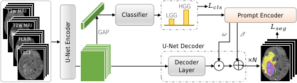
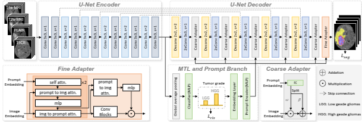
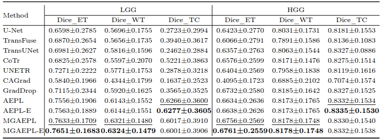

## MGAEPL: Multi-Granularity Automated and Editable Prompt Learning for Brain Tumor Segmentation
This repository provides the code for conference paper "AEPL: Automated and Editable Prompt Learning for Brain Tumor Segmentation, ISBI 2025" and its journal version "MGAEPL: Multi-Granularity Automated and Editable
Prompt Learning for Brain Tumor Segmentation". 



Fig. 1. Structure of AEPL.


Fig. 1. Structure of MGAEPL.

### Requirementss
Some important required packages include:
* [Pytorch][torch_link] version >=0.4.1.
* Python == 3.7 
* Some basic python packages such as Numpy.
* nnUNetv1
* Follow official guidance to install [Pytorch][torch_link]. 
* Follow official guidance to install [nnUNetv1][nnUNetv1_link].

[torch_link]:https://pytorch.org/
[nnUNetv1_link]:https://github.com/MIC-DKFZ/nnUNet/tree/nnunetv1?tab=readme-ov-file#installation

## Dataset
We experiment on [BraTS2018][BraTS2018_link] and [BraTS2021][BraTS2018_link].

[BraTS2018_link]:https://www.med.upenn.edu/sbia/brats2018/data.html
[BraTS2021_link]:https://www.cancerimagingarchive.net/analysis-result/rsna-asnr-miccai-brats-2021/
## Usages
### Preprocess
```
python ./preprocess/BraTS.py
python ./preprocess/generate_json.py
nnUNet_plan_and_preprocess -t 501 --verify_dataset_integrity
```

### AEPL Train
```
CUDA_VISIBLE_DEVICES=0 nnUNet_train 3d_fullres nnUNetTrainerV2_AEPL 501 0
```

### AEPL Test
```
CUDA_VISIBLE_DEVICES=0 nnUNet_predict -i /nnUNet/nnUNet_raw/nnUNet_raw_data/Task501_BraTS/imagesTs/ -o /nnUNet/nnUNet_output/Task501_BraTS/nnUNetTrainerV2_AEPL/fold_0 -t 501 -m 3d_fullres -f 0 -tr nnUNetTrainerV2_AEPL
```
### MGAEPL Train
```
CUDA_VISIBLE_DEVICES=0 nnUNet_train 3d_fullres nnUNetTrainerV2_MGAEPL 501 0
```

### MGAEPL Test
```
CUDA_VISIBLE_DEVICES=0 nnUNet_predict -i /nnUNet/nnUNet_raw/nnUNet_raw_data/Task501_BraTS/imagesTs/ -o /nnUNet/nnUNet_output/Task501_BraTS/nnUNetTrainerV2_MGAEPL/fold_0 -t 501 -m 3d_fullres -f 0 -tr nnUNetTrainerV2_MGAEPL
```
2. Our experimental results are shown in the table:



## Acknowledgements

This project is developed based on [nnUNetv1](https://github.com/MIC-DKFZ/nnUNet/tree/nnunetv1), and we appreciate their original work and open-source contribution.

